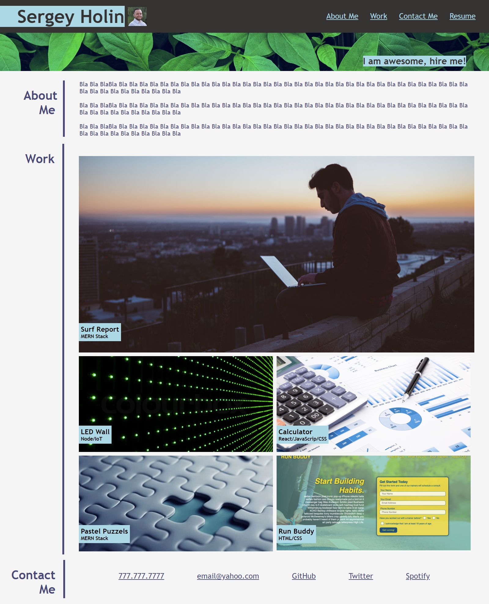

# Challenge-2
Challenge 2, Week 2 by Sergey Holin:

URL of the GitHub repository: https://github.com/sergeyholin/Challenge-2

URL of the deployed application: https://sergeyholin.github.io/Challenge-2/

ACCEPTANCE CRITERIA:

GIVEN I need to sample a potential employee's previous work
*WHEN I load their portfolio
THEN I am presented with the developer's name, a recent photo or avatar, and links to sections about them, their work, and how to contact them
*WHEN I click one of the links in the navigation
THEN the UI scrolls to the corresponding section
*WHEN I click on the link to the section about their work
THEN the UI scrolls to a section with titled images of the developer's applications
*WHEN I am presented with the developer's first application
THEN that application's image should be larger in size than the others
*WHEN I click on the images of the applications
THEN I am taken to that deployed application
*WHEN I resize the page or view the site on various screens and devices
THEN I am presented with a responsive layout that adapts to my viewport

ADDITIONAL CRITERIA:

*Application deployed at live URL.

SOURCES & CITATIONS:

1) Used a code for turning div image into a hyperlinlk in HTML from stackoverflow by Joel Etherton.
Link: https://stackoverflow.com/questions/2188272/html-how-to-make-an-entire-div-a-hyperlink

2) Used a picture from internet as a background element for my application.
A) Link: https://unsplash.com/photos/frWOcVisp8U
B) Link: https://unsplash.com/photos/Z3ownETsdNQ
C) Link: https://www.colourbox.com/image/led-wall-background-image-1908935
D) Link: https://ak.picdn.net/shutterstock/videos/3556961/thumb/4.jpg
E) Link: https://img1.goodfon.com/wallpaper/nbig/5/f1/paper-calculator-economy.jpg
F) Link: https://user-images.githubusercontent.com/77648727/107858055-eb266600-6de6-11eb-80a7-3dfeeaa5ec4b.png

3) Used bits of code from class lessons.

SCREENSHOT:

